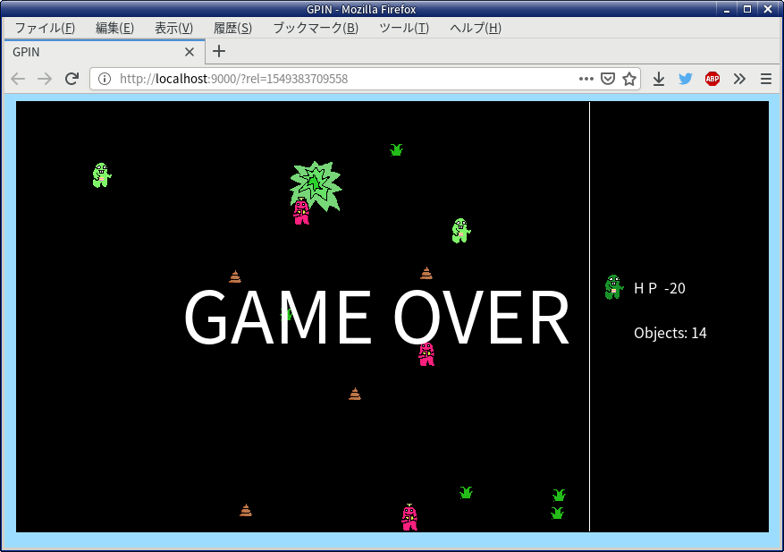

# GPIN ClojureScript版

わちゃわちゃしたゲーム https://github.com/fusuya/GPIN のフォークです。

## ゲーム内容

Gピンを操作してMックを殲滅するゲーム

お互い初期 HP 50で始まります。
草を食べるとHPが10上がり、自動で動くGピンが一匹増えます。
ムックよりHPが高い状態で体当りするとムックが消えます。

## 操作説明

```
z       決定
↑→↓←    移動
```

## 起動方法

```
clj --main cljs.main --compile hello-world.core --repl
```

※ 環境によってはブラウザを先に起動しておかないとREPLが表示されません。



## 参考URL

[ClojureScript - Quick Start](https://clojurescript.org/guides/quick-start)
